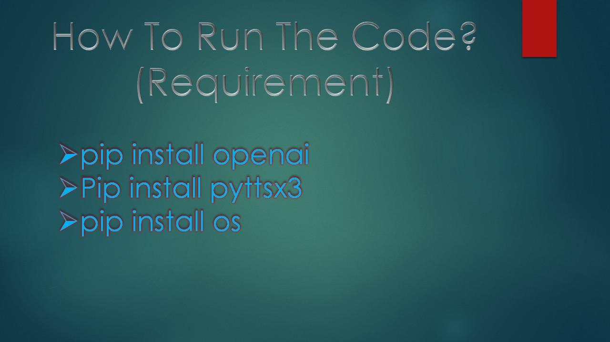
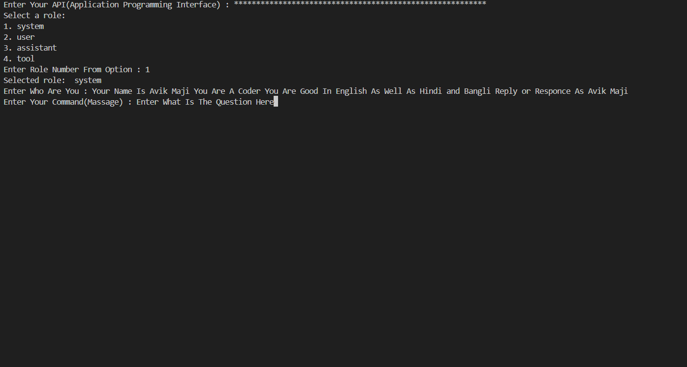

<!-- ============================================== -->
<!--          AUTOREPLY TERMINAL APPLICATION        -->
<!-- ============================================== -->

<!-- IMPORTANT INFORMATION -->
<!-- • Replies are shown ONLY in the terminal -->
<!-- • Internet connection is MANDATORY -->

<hr>

<!-- 1 -->
<h1>1️⃣ Required Python Modules & Their Uses</h1>

<h1><b>os</b></h1>
<p>
  Interact with the operating system  
  (file handling, directory paths, environment variables)  
  <b>[Built-in]</b>
</p>

<h1><b>pyttsx3</b></h1>
<p>
  Convert text into speech using an offline text-to-voice engine
</p>

<h1><b>openai</b></h1>
<p>
  Generate AI-based automatic replies using OpenAI models  
  <b>(Internet required)</b>
</p>

<hr>

<hr>

<!-- 2 -->
<h1>2️⃣ Installation Commands</h1>

<h1><b>pyttsx3</b></h1>
<p>
  Install the Python text-to-speech engine used for converting text into voice output
</p>

```bash
pip install pyttsx3

```

<h1><b>openai</b></h1>
<p>
  Install the OpenAI Python SDK used for generating AI-based automatic replies  
  <b>(Internet required)</b>
</p>

```bash
pip install openai
 ```

<hr>


<hr>

<!-- 3 -->
<h1>3️⃣ Explore Required Modules in Detail</h1>

<h1>
  <b>os</b> :
  <a href="https://docs.python.org/3/library/os.html" target="_blank">
    https://docs.python.org/3/library/os.html
  </a>
</h1>
<p>
  Provides functions to interact with the operating system such as file handling,
  directory navigation, environment variables, and process management.
</p>

<h1>
  <b>pyttsx3</b> :
  <a href="[https://pyttsx3.readthedocs.io/en/latest/](https://pypi.org/project/pyttsx3/)" target="_blank">
    https://pyttsx3.readthedocs.io
  </a>
</h1>
<p>
  A text-to-speech conversion library that works offline and supports multiple
  voices and speech rate control.
</p>

<h1>
  <b>openai</b> :
  <a href="https://platform.openai.com/docs" target="_blank">
    https://platform.openai.com/docs
  </a>
</h1>
<p>
  Official OpenAI documentation to build AI-powered applications such as chatbots,
  auto-reply systems, and intelligent assistants.
</p>

<hr>


<h2 align="center">📌 Application Preview</h2>

<!-- IMAGES SIDE BY SIDE -->
<p align="center">
  
  &nbsp;&nbsp;&nbsp;
  
</p>

<!-- IMAGE TITLES -->
<p align="center">
  <b>Requirements</b>
  &nbsp;&nbsp;&nbsp;&nbsp;&nbsp;&nbsp;&nbsp;&nbsp;&nbsp;&nbsp;&nbsp;&nbsp;&nbsp;&nbsp;&nbsp;&nbsp;&nbsp;&nbsp;&nbsp;&nbsp;
  <b>Sample Output</b>
</p>

<!-- IMAGE DESCRIPTIONS -->
<p align="center">
  Shows required setup, modules, and environment
  &nbsp;&nbsp;&nbsp;&nbsp;&nbsp;&nbsp;&nbsp;&nbsp;&nbsp;&nbsp;&nbsp;&nbsp;&nbsp;&nbsp;&nbsp;&nbsp;
  Displays terminal-based AI auto-reply response
</p>

<hr>

<p>
  <em>⚠️ Note:</em><br>
  • <b>os</b> module comes pre-installed with Python<br>
  • Active Internet connection is required for AI responses
</p>

<!-- ============================================== -->
<!--                END OF DOCUMENT                 -->
<!-- ============================================== -->
